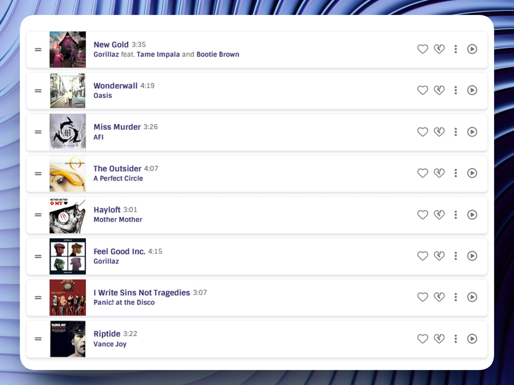
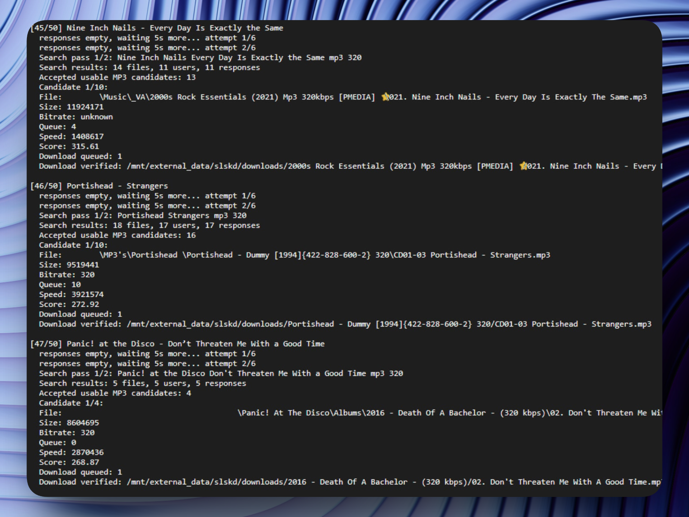
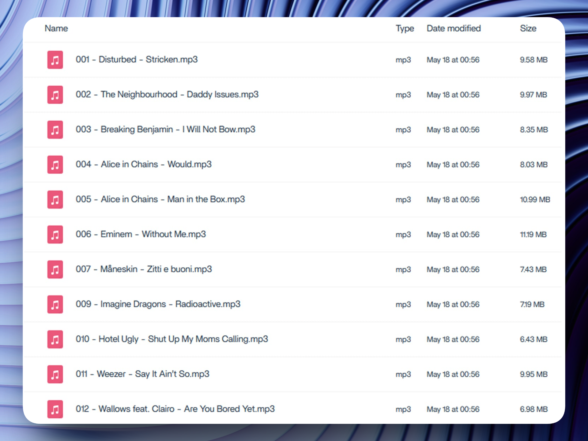

# Soulkeep


Soulkeep turns ListenBrainz `.jspf` playlists into clean music folders using Soulseek and `slskd`.

It is useful for self-hosted music libraries, Jellyfin setups, and local music collections. You give Soulkeep a JSPF playlist, it asks `slskd` to find and download matching MP3 files, verifies what actually appeared on disk, then creates a clean final folder with stable filenames and clean metadata.

> Use Soulkeep only with music you are legally allowed to download, store, and play.

```text
ListenBrainz JSPF playlist
        ↓
Soulkeep
        ↓
slskd / Soulseek downloads
        ↓
Clean final music folder
```

Example output:

```text
001 - Artist - Song Title.mp3
002 - Artist - Another Song.mp3
003 - Artist - Third Song.mp3
```


## Features

* Reads ListenBrainz `.jspf` playlists
* Preserves the original playlist order
* Searches tracks through the `slskd` API
* Filters bad Soulseek results
* Prefers usable MP3 files
* Retries multiple candidates when users reject, timeout, or disconnect
* Verifies that a downloaded file really appeared on disk
* Moves only verified files into the final folder
* Keeps late, failed, fuzzy, or unmatched candidates out of the final library
* Renames files into stable numbered filenames
* Cleans old ID3 metadata
* Writes fresh title, artist, album, album artist, and track number tags
* Supports artwork handling depending on the script version
* Works locally, on a Linux server, or in a CasaOS-style self-hosted setup

The most important behavior:

```text
Only verified manifest files are moved into the final music folder.
```

This protects your final library from duplicate files, bad fuzzy matches, late Soulseek downloads, and random leftovers.


## Requirements

* Node.js 18 or newer
* npm
* ffmpeg
* A running `slskd` instance
* A slskd API key
* A `.jspf` playlist
* A folder where `slskd` saves completed downloads
* A final music folder for Jellyfin or another music player


## Quick start

```bash
git clone https://github.com/notalent13/soulkeep.git
cd soulkeep
npm install
cp .env.example .env
```

Edit `.env`:

```env
SLSKD_API_URL=http://localhost:5030/api/v0
SLSKD_API_KEY=YOUR_SLSKD_API_KEY
SLSKD_DOWNLOADS_PATH=./downloads
FINAL_MUSIC_PATH=./music
```

Make sure `slskd` is already running.

Run:

```bash
npm start
```

Or pass a playlist manually:

```bash
node src/download-jspf.mjs "/path/to/playlist.jspf"
```


## Documentation

* [Installation](docs/INSTALLATION.md)
* [Environment configuration](docs/ENVIRONMENT.md)
* [Usage](docs/USAGE.md)
* [Jellyfin notes](docs/JELLYFIN.md)
* [Troubleshooting](docs/TROUBLESHOOTING.md)


## Example workflow

### 1. ListenBrainz playlist



### 2. Soulkeep processing



### 3. Final music folder




## Project structure

```text
soulkeep/
├── src/
│   └── download-jspf.mjs
├── docs/
│   ├── INSTALLATION.md
│   ├── ENVIRONMENT.md
│   ├── USAGE.md
│   ├── JELLYFIN.md
│   └── TROUBLESHOOTING.md
├── sample-playlists/
│   └── listenbrainz-playlist.jspf
├── .env.example
├── .gitignore
├── package.json
├── README.md
├── LICENSE
├── SECURITY.md
└── CONTRIBUTING.md
```


## Development

Check syntax:

```bash
npm run check
```

Run:

```bash
npm start
```


## Security

Never commit your real `.env`, slskd API key, logs, downloaded music, or private playlist data.

Use `.env.example` for public configuration.


## Support

If Soulkeep helps you build and maintain your music library, consider supporting future development:

https://ko-fi.com/notalent13


## License

GPL-3.0-or-later.

